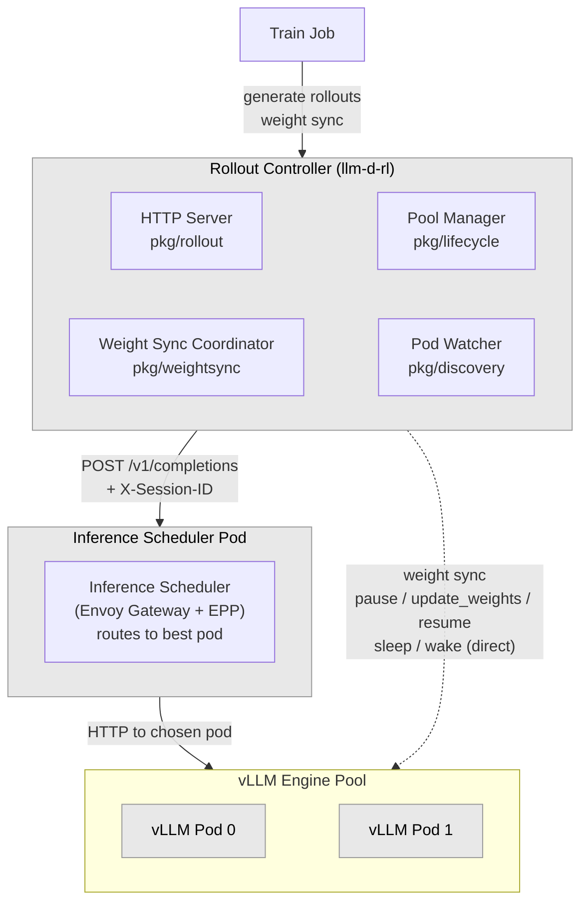
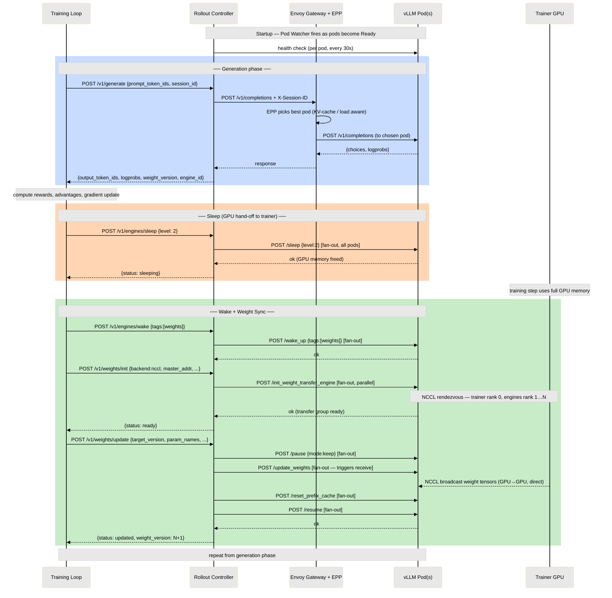

# llm-d-rl Architecture

## Component Architecture

## RL Training Step — Interaction Sequence

## Key Design Points

| Path | Route | Why |
|---|---|---|
| Inference | Training Loop → RC → Inference Scheduler → vLLM pod | KV-cache-aware, session-affinity routing |
| Weight sync | RC → each vLLM pod directly | Per-engine control operations (pause/resume/sync) |
| Weight data | Trainer GPU → vLLM GPUs (NCCL/NIXL) | RC orchestrates the lifecycle but never proxies tensors |
| Pod discovery | Kubernetes API → Pod Watcher → Pool Manager + Coordinator | Label selector; no static IPs |
