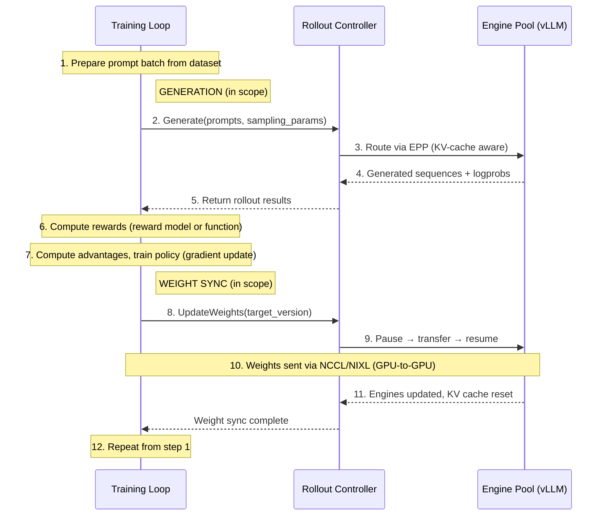
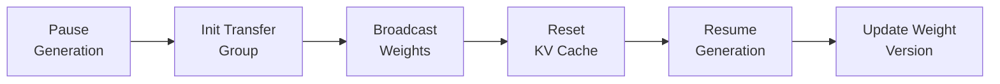
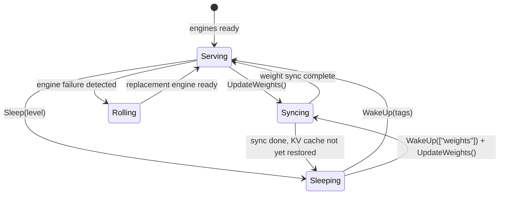
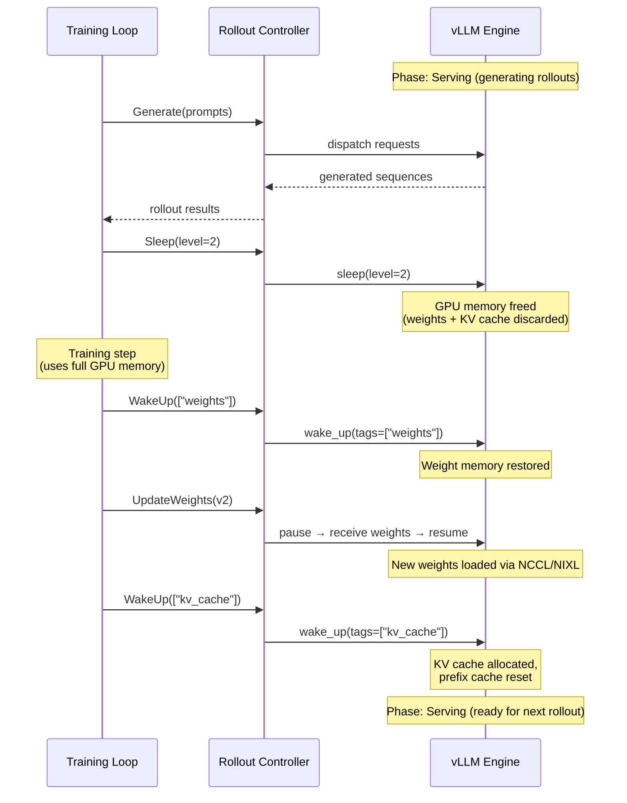
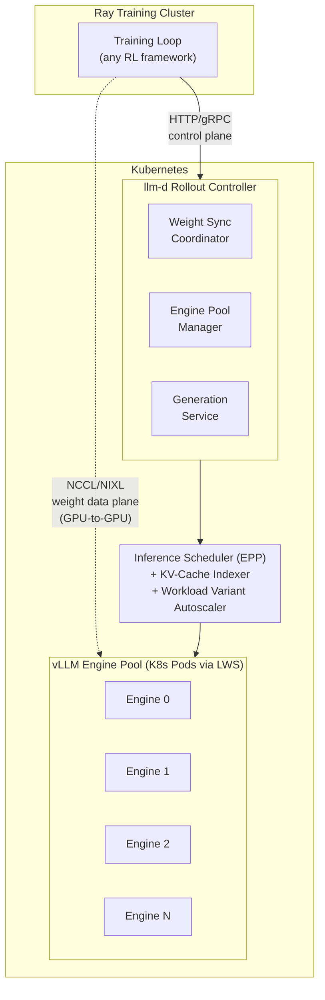
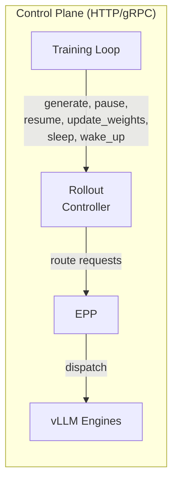
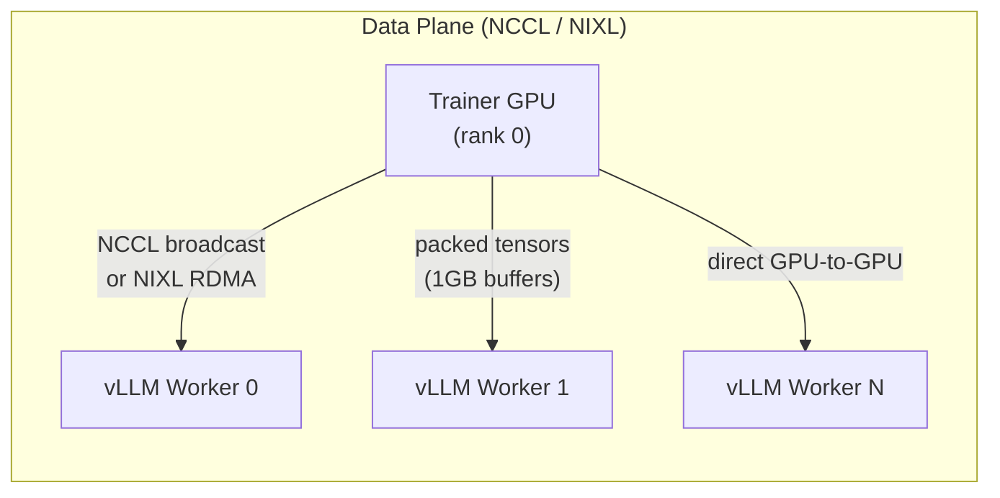

# llm-d RL rollout infrastructure north star

## Background

The RL post-training ecosystem is taking shape rapidly but remains fragmented across frameworks like [veRL](https://github.com/volcengine/verl), [Slime](https://github.com/THUDM/slime), [SkyRL](https://github.com/NovaSky-AI/SkyRL), [OpenRLHF](https://github.com/OpenRLHF/OpenRLHF), and [NeMo-RL](https://github.com/NVIDIA-NeMo/RL). While each has its own opinions on training orchestration, algorithm implementation, and reward modeling, they all depend on the same low-level rollout infrastructure: the inference engine pool that generates token sequences during RL training loops.

Today, every framework re-implements this infrastructure as framework-specific glue code tightly coupled to a single inference engine (usually vLLM or SGLang) and a single orchestrator (Ray). There is no shared, reusable, production-grade rollout layer.

Useful context for this document:
- [vLLM RLHF Documentation](https://docs.vllm.ai/en/latest/training/rlhf.html)


## TL;DR

Every major RL post-training framework needs the same five rollout primitives from its inference layer: weight synchronization, engine lifecycle management, load-aware routing, asynchronous generation, and partial rollout control. Today each framework builds these as ad-hoc glue code tightly coupled to a specific inference engine and orchestrator.

The llm-d RL rollout infrastructure proposes to extract these five primitives into a Kubernetes-native, framework-agnostic rollout service that any RL training loop can consume. By exposing an HTTP/gRPC control plane with a high-performance NCCL/NIXL data plane for weight transfer, llm-d becomes the neutral infrastructure layer beneath all RL frameworks, replacing what Ray does for inference management while letting frameworks keep Ray for training orchestration.

This positions vLLM+llm-d as the natural entry point for any lab doing RL post-training, regardless of which framework they choose.


## Scope

To define the scope of the RL rollout infrastructure, we use the example of a typical RL training step (e.g., GRPO/PPO) to illustrate where llm-d intervenes:



In scope: steps 2–4 (generation dispatch and routing) and steps 8–11 (weight synchronization lifecycle). These are the rollout infrastructure primitives — the components llm-d provides as a managed service.

Out of scope: the training loop itself (step 1, 6, 7, 12), reward computation, algorithm choice (PPO vs. GRPO vs. DAPO), and training-side gradient synchronization. These remain the responsibility of the RL framework.

Expanding scope to include reward-model-driven trajectory pruning (active partial rollouts) is a stretch goal discussed below.


## Goal

This rollout infrastructure is intended to be the production-grade, framework-agnostic standard for RL inference rollout on Kubernetes. The expectation is that this layer will be adopted due to:

- **Framework independence** — works with any RL framework via standard APIs
- **Kubernetes-native operations** — health checks, auto-recovery, autoscaling, topology-aware placement
- **Performance by default** — KV-cache-aware routing, NIXL weight transfer, Wide-EP support
- **Clean separation of concerns** — training loops stay in Ray/framework land; inference management moves to llm-d

The remainder of this document explores how each of these is achieved.

## Rollout primitives

### Analysis: what every framework builds

We conducted a deep technical analysis of five major RL frameworks. The following table summarizes how each implements the common rollout infrastructure:

| Primitive | veRL | Slime | SkyRL | OpenRLHF | NeMo-RL |
|---|---|---|---|---|---|
| **Engine(s)** | vLLM, SGLang, TRT-LLM | SGLang only | vLLM, SGLang, Remote | vLLM only | vLLM, SGLang, Megatron |
| **Weight sync** | CUDA IPC / NCCL / NIXL | CUDA IPC / NCCL (SGLang) | CUDA IPC / NCCL | NCCL / CUDA IPC | ZMQ IPC / NCCL / HTTP |
| **Health checks** | Worker aliveness + HTTP polling | Yes + auto-restart | Poll only | None | None |
| **Load routing** | SGLang router + hash-based | Least-inflight | Round-robin / hash | Min-heap (queue depth) | Round-robin |
| **Async gen** | Yes (async rollout mode) | Semi + fully async | Fully async (staleness) | Async (backpressure) | Async (replay buffer) |
| **Partial rollout** | Abort/resume (async mode) | Dynamic sampling | Abort + retry | No | In-flight weight updates |
| **Orchestrator** | Ray | Ray | Ray | Ray | Ray |
| **K8s-native?** | No | No | No | No | No |

Key observations:

1. **All five frameworks use Ray** as their orchestrator and manage inference engines as Ray actors. None are Kubernetes-native.
2. **All five implement the same weight sync patterns** — CUDA IPC for colocated GPUs, NCCL broadcast for disaggregated. The implementations are nearly identical.
3. **Slime has the most complete health monitoring** with automatic engine replacement. veRL has worker aliveness checks (background thread with SIGABRT on failure) and HTTP health polling, but no automatic replacement. Other frameworks crash on engine failure.
4. **Load routing ranges from basic to primitive** — veRL integrates SGLang's router and has hash-based session routing, but no framework leverages KV-cache locality, prefix reuse, or predicted latency.
5. **Async generation is everywhere but inconsistent** — each framework invents its own staleness control, backpressure, and version tracking.

### Primitive 1: weight synchronization

The problem: after each training step, updated model weights must be pushed to live inference engines without restarting them. This is the most performance-critical primitive — large models (70B+ parameters) require transferring tens of gigabytes of weight data.

Current state: every framework implements its own weight transfer pipeline using the same two mechanisms:

- **Colocated (same GPU):** CUDA IPC handles + ZMQ metadata channel for zero-copy transfer
- **Disaggregated (different GPUs):** NCCL broadcast from trainer rank 0 to all engine workers

vLLM already has native support for both via the `WeightTransferEngine` abstraction (NCCL backend with packed tensor transfer, layerwise reload with auto-requantization) and HTTP endpoints (`/init_weight_transfer_engine`, `/update_weights`) behind `VLLM_SERVER_DEV_MODE`.

What llm-d provides:



- A weight sync controller that orchestrates the full lifecycle: pause generation → establish transfer group → transfer weights → reset KV cache → resume generation
- Support for multiple transport backends: NCCL (default), NIXL/RDMA (high-performance cross-node), and checkpoint path (load from shared storage)
- **Packed tensor transfer** with double-buffering for bandwidth efficiency (matching vLLM's 1GB buffer pipeline)
- **Weight version tracking** — every engine reports its current weight version; the controller ensures consistency across the pool
- Transparent handling of quantization mismatches — trainers send bf16/fp16, llm-d leverages vLLM's layerwise reload to process and repack weights for fp8/int4 inference

### Primitive 2: engine lifecycle management

The problem: inference engines must be started, health-checked, recovered on failure, and have their GPU memory managed (sleep/wake) when sharing resources with training.

Current state: Slime has the most complete health monitoring with auto-restart. veRL has worker aliveness monitoring and HTTP health polling but no automatic replacement. Other frameworks crash on engine failure. vLLM provides three sleep levels (0: pause scheduling, 1: offload weights to CPU, 2: discard all GPU memory) and tagged wake-up (weights, kv_cache independently).

What llm-d provides:

- **Kubernetes-native pod lifecycle** — liveness probes, readiness gates, automatic pod replacement
- An engine pool controller that maintains N healthy engines, replacing failed ones and reconnecting weight sync groups
- **Sleep/wake orchestration** for colocated deployments, as shown below
- **Mode transitions** exposed via CRD status:



The colocated sleep/wake lifecycle for a single RL training step:



### Primitive 3: load-aware routing

The problem: generation requests must be distributed across engine instances for maximum throughput.

Current state: ranges from basic routing (veRL's SGLang router integration with hash-based session affinity) to simple min-heap by queue depth (OpenRLHF). No framework leverages KV-cache locality, prefix reuse, or predicted latency — capabilities llm-d already has.

What llm-d provides:

- The existing inference scheduler (EPP) with KV-cache-aware routing, prefix-cache affinity, and predicted latency scoring
- **Session affinity** for multi-turn RL rollouts — keeps KV cache warm on the same engine across conversation turns
- **RL-specific routing policies** — e.g., route reward model scoring and policy generation to different engine pools
- **Batch-aware dispatch** — understands RL batch boundaries and distributes evenly across engines

### Primitive 4: asynchronous generation

The problem: overlapping generation with training increases GPU utilization, but requires careful coordination of weight versions, staleness bounds, and backpressure.

Current state: every framework has some form of async generation, but implementations differ significantly. SkyRL has the best staleness control (capacity-based bounds from the [AReal](https://arxiv.org/abs/2505.24298) paper). NeMo-RL tracks weight versions in a replay buffer. OpenRLHF uses token-bucket backpressure.

What llm-d provides:

- A generation service with built-in request queuing, priority, and backpressure
- **Weight version tagging** — every generated output is tagged with the weight version that produced it
- **In-flight weight update support** using vLLM's `PauseMode.KEEP` — freeze requests in place, swap weights, resume without discarding partial work
- **Configurable staleness bounds** — the controller can reject or deprioritize generations from stale weight versions

### Primitive 5: active partial rollouts (stretch goal)

The problem: in RL training, many generated trajectories are low-quality and waste compute. Pruning unpromising trajectories mid-generation could free significant resources.

Current state: this is the least developed primitive. Slime has dynamic sampling with oversampling + filtering. SkyRL can abort and retry with accumulated tokens. No framework scores trajectories mid-generation with a reward model.

What llm-d could provide:

- A reward-model sidecar that scores partial generations in real-time
- An abort policy in the inference scheduler that terminates low-reward trajectories
- **Compute reallocation** — freed capacity from pruned trajectories is immediately available for more promising ones
- Integration with the existing request lifecycle (cancel, redirect) in the EPP


## Architecture

### Integration model: HTTP control plane + NCCL/NIXL data plane

The key architectural decision is how RL training loops (running in Ray) communicate with llm-d (running on Kubernetes). We propose a hybrid approach:



The two communication paths are intentionally separate:





Why this split:

- **Control plane (HTTP/gRPC):** generation requests, pause/resume, lifecycle queries, weight sync orchestration. Goes through llm-d's inference scheduler for intelligent routing. Accessible from any language/framework without dependencies.
- **Data plane (NCCL/NIXL):** actual weight tensor transfer. Direct GPU-to-GPU between training nodes and vLLM pods. llm-d orchestrates group setup but does not proxy tensor data. This matches vLLM's native `WeightTransferEngine` pattern.

Why not Ray inside llm-d:

- Loses the Kubernetes-native advantage (LWS provides better topology-aware placement, all-or-nothing failure semantics)
- Couples llm-d to Ray's versioning and runtime model
- Frameworks keep using Ray for training; llm-d replaces what Ray does for inference management
- The HTTP/gRPC boundary is what makes it truly framework-agnostic

### Relationship to existing llm-d components

| Existing component | RL rollout application |
|---|---|
| **Inference scheduler (EPP)** | Routes generation requests with KV-cache awareness and session affinity |
| **KV-cache indexer** | Tracks block locality for prefix reuse across multi-turn RL rollouts |
| **P/D disaggregation** | Separates prefill (new prompts) from decode (continuations) |
| **Workload variant autoscaler** | Scales engine pool based on RL training demand signals |
| **NIXL / pd-utils** | RDMA transport for high-bandwidth weight transfer |
| **fast-model-actuation** | Sleep/wake lifecycle management for colocated deployments |

The RL rollout infrastructure is not a separate stack — it extends llm-d's existing components with new coordination logic and APIs for the RL use case.

## API surface

### Rollout control API (HTTP/gRPC)

```
service RolloutControl {
  // === Generation ===
  rpc Generate(GenerateRequest) returns (stream GenerateResponse);
  rpc GenerateBatch(BatchGenerateRequest) returns (BatchGenerateResponse);
  rpc AbortGeneration(AbortRequest) returns (AbortResponse);

  // === Weight Management ===
  rpc InitWeightTransfer(WeightTransferInit) returns (WeightTransferReady);
  rpc UpdateWeights(WeightUpdateRequest) returns (WeightUpdateResponse);
  rpc GetWeightVersion(Empty) returns (WeightVersion);

  // === Engine Lifecycle ===
  rpc PauseGeneration(PauseRequest) returns (PauseResponse);
  rpc ResumeGeneration(Empty) returns (ResumeResponse);
  rpc Sleep(SleepRequest) returns (SleepResponse);
  rpc WakeUp(WakeUpRequest) returns (WakeUpResponse);

  // === Pool Status ===
  rpc GetPoolStatus(Empty) returns (PoolStatus);
  rpc GetEngineStatus(EngineId) returns (EngineStatus);
}
```

Key message types:

```
message GenerateRequest {
  repeated int32 prompt_token_ids = 1;
  SamplingParams sampling_params = 2;
  string session_id = 3;           // For multi-turn affinity
  bool return_logprobs = 4;
  int64 weight_version = 5;        // Expected weight version
}

message WeightTransferInit {
  string backend = 1;              // "nccl" | "nixl"
  string master_address = 2;
  int32 master_port = 3;
  int32 trainer_world_size = 4;
  bool packed = 5;                 // Use packed tensor transfer
  bool is_checkpoint_format = 6;   // Needs requantization?
}

message WeightUpdateRequest {
  int64 target_version = 1;
  PauseMode pause_mode = 2;        // ABORT | WAIT | KEEP
  bool reset_kv_cache = 3;
}

message PauseRequest {
  PauseMode mode = 1;              // ABORT | WAIT | KEEP
}

message SleepRequest {
  int32 level = 1;                 // 0 | 1 | 2
}

message WakeUpRequest {
  repeated string tags = 1;        // ["weights"] | ["kv_cache"] | ["weights", "kv_cache"]
}
```

### Kubernetes CRD (future)

```yaml
apiVersion: llm-d.io/v1alpha1
kind: RolloutEnginePool
metadata:
  name: llama-70b-rollout
spec:
  model: meta-llama/Llama-3.3-70B-Instruct
  engineCount: 8
  tensorParallelSize: 4
  accelerator: nvidia-h100
  weightSync:
    backend: nccl
    autoResume: true
  lifecycle:
    healthCheckInterval: 30s
    autoRestart: true
    sleepLevel: 2
  routing:
    policy: kv-cache-aware
    sessionAffinity: true
status:
  phase: Serving          # Serving | Rolling | Sleeping | Syncing
  readyEngines: 8
  weightVersion: 42
  lastWeightSync: "2026-02-27T10:00:00Z"
```

## Alternatives

### Let each framework manage its own engines

This is the status quo. Every framework bundles its own inference management as Ray actors with framework-specific glue code.

Unlike this approach, llm-d RL rollout:

- Provides Kubernetes-native operations (health, auto-restart, autoscaling) that no framework has
- Eliminates redundant re-implementation across five+ frameworks
- Enables labs to switch RL frameworks without changing their inference infrastructure
- Leverages llm-d's existing scheduling, KV-cache indexing, and NIXL capabilities

### Build on SGLang (Slime's approach)

Slime demonstrates the most complete rollout infrastructure today, but it is deeply coupled to SGLang's internal APIs (`FlattenedTensorBucket`, `MultiprocessingSerializer`, `ServerArgs`).

Unlike Slime's approach, llm-d RL rollout:

- Works with vLLM, SGLang, or any OpenAI-compatible engine
- Does not import or depend on inference engine internals
- Operates via standard HTTP/gRPC APIs and NCCL/NIXL data plane
- Provides Kubernetes-native lifecycle management rather than Ray actor management

### Build a Ray-native rollout service

An alternative would be to ship llm-d rollout components as Ray actors that frameworks can drop in.

Unlike a Ray-native approach, llm-d RL rollout:

- Does not take a dependency on Ray's versioning and runtime model
- Leverages Kubernetes primitives (LWS, HPA, pod lifecycle) for operations
- Is consumable from any orchestrator (Ray, bare Python, Kubernetes Jobs) via HTTP/gRPC
- Maintains the clean separation that makes llm-d framework-agnostic

### Use NVIDIA Dynamo for RL

Dynamo's Distributed Runtime provides some overlapping capabilities (weight management, engine lifecycle).

Unlike Dynamo, llm-d RL rollout:

- Is open-source and vendor-neutral
- Operates above the engine (does not require Dynamo's runtime inside vLLM)
- Composes with existing Kubernetes infrastructure
- Supports multiple accelerator families


## Competitive landscape: why urgency matters

Slime + SGLang is currently the most complete RL rollout stack and is driving SGLang adoption in the RL community. Labs that adopt Slime become effectively locked into SGLang as their inference engine. Key advantages Slime has today:

- Health monitoring with automatic engine replacement
- Colocated training with CUDA VMM-based memory management
- Custom router with least-inflight routing
- Tight integration with SGLang's weight update APIs
- Wide-EP support for DeepSeek-class MoE models

Our window to intercept this: these adoption decisions are being made now. Switching costs compound over time. If we can deliver Wide-EP parity plus a clean rollout API, the framework layer becomes more commoditized and we own the infrastructure beneath all of them.

The counter-strategy: make vLLM+llm-d provide all five rollout primitives natively and with superior operational characteristics (K8s-native health, auto-recovery, topology-aware placement, KV-cache-aware routing). Labs can then choose their RL framework independently of their inference engine.


## Cross-community investment

Cross-community investment is key for this layer to become the standard. Initial outreach:

- **vLLM team** — upstream weight transfer and lifecycle APIs we depend on
- **veRL** — strongest existing vLLM integration; natural first consumer
- **SkyRL** — already has `RemoteInferenceEngine` pattern (HTTP client to external engines)
- **OpenRLHF** — largest community (9k stars); vLLM-only, would benefit from managed engine pool
- **NeMo-RL** — sophisticated weight sync; NVIDIA alignment on NIXL
- **Kubernetes SIG Scheduling / SIG AI** — upstream CRD and API alignment
- **Gateway API Inference Extension** — extension points for RL-specific routing policies
