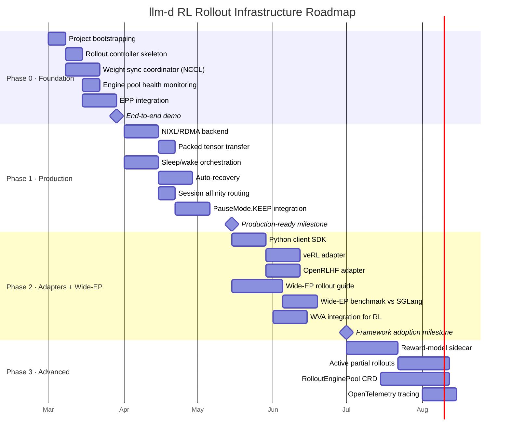
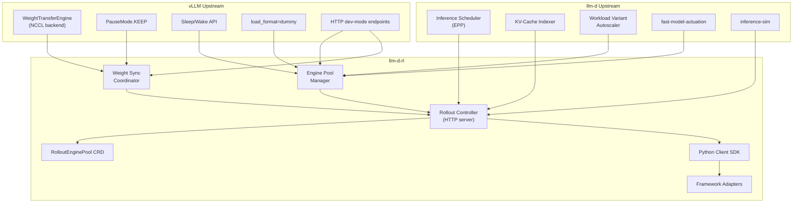

# llm-d RL Rollout Infrastructure Roadmap

## Overview

## Phases

### Phase 0: Foundation (Weeks 1–4)

Establish the project, validate the API surface with one framework, and prove the weight sync path end-to-end.

- [ ] **Project bootstrapping:** Repository, CI, Go module, API protobuf definitions
- [ ] **Rollout Controller skeleton:** HTTP/gRPC server exposing the RolloutControl API surface
- [ ] **Weight sync coordinator (NCCL path):** Orchestrate pause → init transfer group → broadcast → resume using vLLM's native `WeightTransferEngine` HTTP endpoints
- [ ] **Engine pool health monitoring:** Periodic health checks against vLLM `/health` endpoint, report pool status
- [ ] **Integration with inference scheduler:** Route `Generate` requests through the existing EPP for KV-cache-aware dispatch
- [ ] **End-to-end demo:** Single training script (e.g., simple GRPO loop) using llm-d rollout controller instead of Ray-managed vLLM actors. Target: OpenRLHF or veRL as first consumer.
- [ ] **llm-d-inference-sim support:** Validate the full lifecycle without GPUs using the existing vLLM simulator

**Exit criteria:** A training script can call llm-d's HTTP API to generate rollouts and push weight updates, with the controller managing vLLM pods on Kubernetes.

---

### Phase 1: Production Primitives (Weeks 5–10)

Harden the five rollout primitives to production quality.

#### Weight Synchronization
- [ ] **NIXL/RDMA backend:** Add NIXL transport for cross-node weight transfer alongside NCCL
- [ ] **Packed tensor transfer:** Implement double-buffered packed transfer matching vLLM's 1GB buffer pipeline
- [ ] **Checkpoint-format support:** Handle bf16 trainer → fp8 inference auto-requantization via vLLM's layerwise reload
- [ ] **Weight version tracking:** Tag every engine with its current weight version; expose via API and metrics

#### Engine Lifecycle
- [ ] **Sleep/wake orchestration:** Full lifecycle controller for colocated deployments (sleep level 0/1/2, tagged wake-up)
- [ ] **Auto-recovery:** Detect failed engines, remove from pool, trigger pod replacement, reconnect weight sync group
- [ ] **Mode transitions:** CRD status tracking: Serving ↔ Rolling ↔ Sleeping ↔ Syncing

#### Load-Aware Routing
- [ ] **Session affinity for RL:** Route multi-turn rollouts to the same engine for KV cache reuse (X-Session-ID header)
- [ ] **RL routing policy in EPP:** Queue-depth-aware dispatch (like OpenRLHF's min-heap) integrated with KV-cache scoring

#### Async Generation
- [ ] **Weight version tagging on outputs:** Every generation response includes the weight version that produced it
- [ ] **PauseMode.KEEP integration:** Freeze in-flight requests during weight update, resume without discarding work
- [ ] **Backpressure API:** Allow training loops to set max outstanding requests per engine

**Exit criteria:** The rollout controller handles engine failures gracefully, supports NCCL and NIXL weight transfer, and routes requests with session affinity and load awareness.

---

### Phase 2: Framework Adapters & Wide-EP (Weeks 11–16)

Make llm-d consumable by existing RL frameworks and achieve Wide-EP parity.

#### Framework Adapters
- [ ] **Python client library (`llm-d-rollout-client`):** Thin Python SDK wrapping the gRPC/HTTP API, pip-installable
- [ ] **veRL adapter:** Replace veRL's `RolloutReplica` / `ServerAdapter` with llm-d client calls
- [ ] **OpenRLHF adapter:** Replace `LLMRayActor` + `create_vllm_engines()` with llm-d client calls
- [ ] **SkyRL adapter:** Map `RemoteInferenceEngine` to llm-d endpoints (closest existing pattern)
- [ ] **NeMo-RL adapter:** Map `VllmGeneration` to llm-d endpoints

#### Wide Expert-Parallelism for RL
- [ ] **Wide-EP rollout guide:** Well-lit path for DeepSeek-R1-class MoE model rollouts using llm-d Wide-EP + LWS
- [ ] **EP-aware routing:** Scheduler understands expert parallelism topology for optimal request placement
- [ ] **Benchmark:** Wide-EP rollout throughput vs. SGLang (Slime) for DeepSeek V3/R1

#### Autoscaling
- [ ] **WVA integration for RL:** Scale engine pool based on training-emitted demand signals (batch size, generation queue depth)
- [ ] **Scale-to-zero between training runs:** Sleep entire engine pool when no training is active

**Exit criteria:** At least two RL frameworks can use llm-d as a drop-in rollout backend. Wide-EP performance matches or exceeds SGLang for MoE models.

---

### Phase 3: Advanced Capabilities (Weeks 17+)

Novel primitives that differentiate llm-d from any existing solution.

#### Active Partial Rollouts
- [ ] **Reward-model sidecar:** Score partial generations in real-time during decode
- [ ] **Abort policy in EPP:** Terminate low-reward trajectories based on configurable thresholds
- [ ] **Compute reallocation:** Freed capacity from pruned trajectories routed to new/better prompts
- [ ] **Benchmark:** Measure compute savings and training efficiency vs. full-length rollouts

#### Multi-Model Rollout
- [ ] **Heterogeneous engine pools:** Manage pools for policy model + reward model + reference model behind a single API
- [ ] **Cross-model orchestration:** Coordinate generation → reward scoring → reference logprob computation as a pipeline

#### RolloutEnginePool CRD
- [ ] **Kubernetes CRD:** Full `RolloutEnginePool` custom resource with spec/status/reconciliation
- [ ] **Operator:** Controller that reconciles desired state (engine count, model, weight version) against actual cluster state
- [ ] **Integration with llm-d-modelservice:** Leverage existing Helm charts for engine pod deployment

#### Observability
- [ ] **OpenTelemetry tracing:** Full distributed trace from training request → rollout controller → EPP → vLLM engine → response
- [ ] **Prometheus metrics:** Weight sync latency, engine utilization, generation throughput, queue depth, weight version skew
- [ ] **Grafana dashboard:** Pre-built dashboard for RL rollout operations

---

## Dependency Graph

## Dependencies and Upstream Work

### vLLM Upstream
- `WeightTransferEngine` NCCL backend (landed)
- `PauseMode.KEEP` for in-flight weight updates (landed in v1)
- HTTP endpoints for weight transfer and sleep/wake behind `VLLM_SERVER_DEV_MODE` (landed)
- CUDA IPC and RDMA backends for `WeightTransferEngine` (planned, not yet implemented)
- `load_format="dummy"` for fast engine startup (landed)

### llm-d Upstream
- Inference Scheduler (EPP) — extend with RL routing policies and session affinity
- KV-Cache Indexer — extend with session-scoped cache tracking
- Workload Variant Autoscaler — extend with RL demand signals
- `llm-d-fast-model-actuation` — leverage sleep/wake controllers
- `llm-d-inference-sim` — extend with weight update simulation for GPU-free testing

### Kubernetes Upstream
- LeaderWorkerSets (LWS) — for multi-node vLLM engine pods
- Gateway API Inference Extension — for routing policy extension points
- HPA/KEDA — for integration with WVA-driven autoscaling

---

## Success Metrics

| Metric | Target |
|---|---|
| **Weight sync latency** (70B model, 8×H100) | < 5s end-to-end (pause → transfer → resume) |
| **Engine recovery time** | < 30s from failure detection to replacement engine ready |
| **Routing overhead** | < 10ms added latency per generation request vs. direct vLLM |
| **Framework adoption** | ≥ 2 frameworks using llm-d rollout API in production |
| **Wide-EP throughput** | ≥ parity with SGLang for DeepSeek-R1 rollouts |
| **GPU utilization** | ≥ 85% during active rollout phases |
